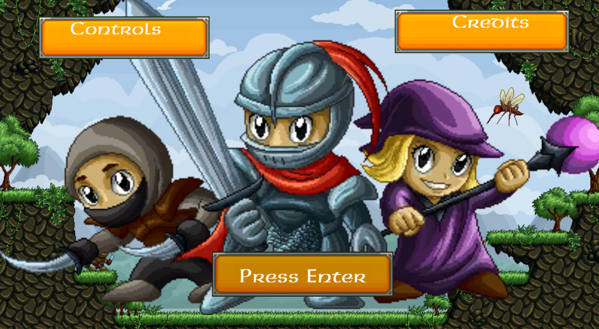
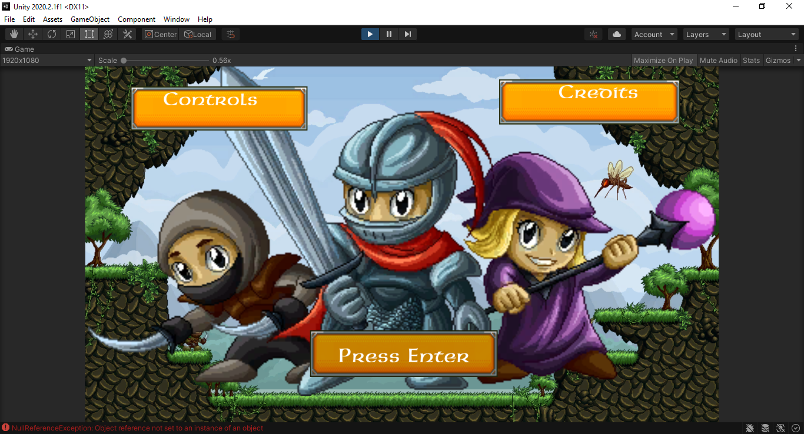
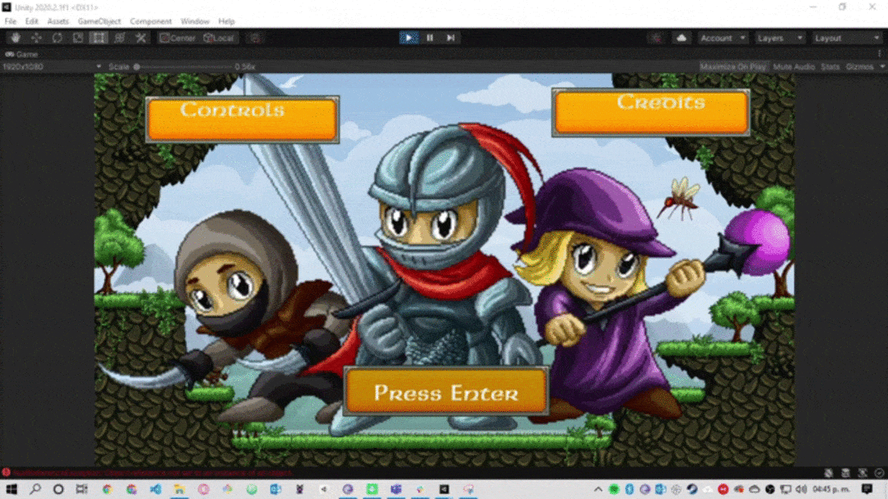
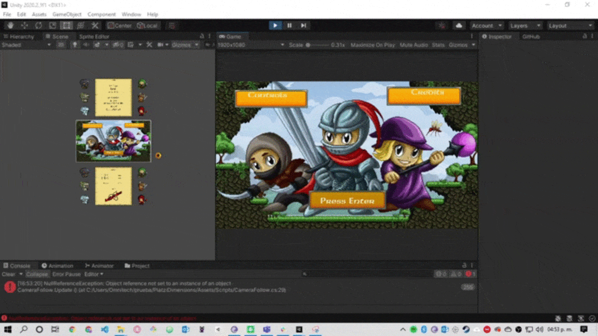
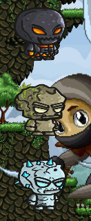
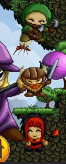

  <h1>Platzi Olimpics - The Game Of Truth</h1>

  

**Table of content**
- [Websites](#websites)
  - [Assets](#assets)
- [Game Summary](#game-summary)
  - [Requirements:](#requirements)
  - [Bonus points:](#bonus-points)
- [Characteristics](#characteristics)
  - [History](#history)
  - [Collectibles](#collectibles)
  - [Visual Style](#visual-style)
  - [Music](#music)
  - [Player Objectives](#player-objectives)

# Websites

## Assets

- https://craftpix.net/
- https://platzi.com/videojuegos/

# Game Summary

## Requirements:

- Debe ser jugable desde itch.io o en su defecto, proveer un ejecutable.
- Prohibido lenguaje y artes obscenos.
- El juego debe de ser desarrollado durante los días de la competencia. Es decir, del 26 de febrero al 04 de marzo.
- Solo usa assets de tu autoría o a los que tengas derecho. No infrinjas copyright y coloca el enlace al sitio de donde los conseguiste cuando subas el videojuego. Recuerda que debes tener permisos comerciales.
- Los equipos son máximo de 5 estudiantes Platzi con suscripción Experto Expert + activa.
- No califican videojuegos que se entreguen después del 05 marzo o en otra plataforma.
- Seguir la temática: ¿Qué es la realidad?
- La comunicación será por Discord. Habrá uno general y cada equipo tendrá un canal propio. Usa tu nombre o usuario de Platzi dentro del servidor. Habrá mentorías y retroalimentación.
- El videojuego debe de ser una mezcla de dos de los siguientes géneros: plataforma, roguelike, rítmico, sim, shooter, runner y puzzle.
- Tiene que incluir: pantalla de inicio, créditos y controles.
- Soporte para mouse y teclado.

## Bonus points:
- Controles configurables.
- Ajuste de dificultad.
- Modo colorblind.
- Ajuste del tamaño del texto.
- Subtítulos si tiene audio.
- Selección de personaje.
- El videojuego está en inglés.
- Soporte para gamepad.

**Common Information**

**Target Audience:** All ages  
**Genre:** 2D Roguelike - Puzzle  
**Engine:** Unity 2020.2.1 f1 
**Release Platform:** PC, WebGL  
**Release Store:** itch.io  

# Characteristics

- Generacion de procedural de masmorras
- Personaje aleatorio entre Golem y Humanos
- Experiencia por muertes de Enemigos

## History
(Por añadir)
Hace muchos soles y lunas durante la expansion de los territorios del hombre, un grupo de exploradores descubrio una tierra Virgen, llena de naturaleza, riquezas, razas y culturas coexistiendo con armonia, pero el hombre cegado por la avaricia se alzo en armas sin pensar en el daño que le hacian destruyendo todo a su paso.

Tras años de Guerra y una exterminacion de las mayoria de razas, los golem quienes despertaban una vez cada 100 años, salieron de las profundidades de la montañas donde permanecian dormidos.

Pero al ver esas atrocidades hechas por el hombre  y llenos de culpa por no haber desperado antes se armaron de valor y decidieron defender su tierra de la avaricia del hombre.

## Collectibles

- Papiros con frases hacerca de la colonizacion y la esclavitud (En Progreso)
- Gemas para seleccion de personajes (En Progreso)

## Visual Style
- Start Scene 

- Creditos 

- Controles 

- Generacion de Masmorras 

- Personasjes 

## Music
- Musica en progreso no implementada en la primera version

## Player Objectives
- Sobrevivir a los Enemigos Generados de manera Aleatoria
- Encontrar el Portal para la siguiente masmorra
- Incremetar el Nivel para aumentar Stats, matando enemigos

